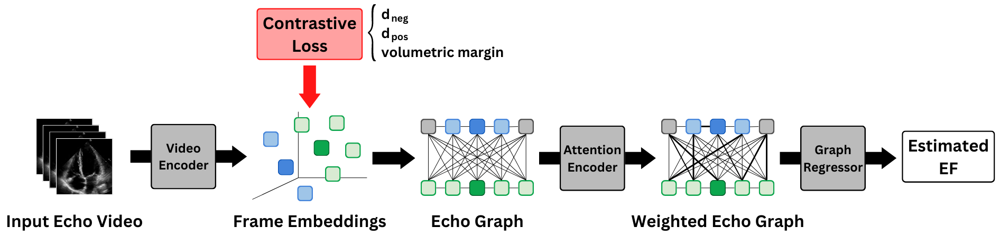
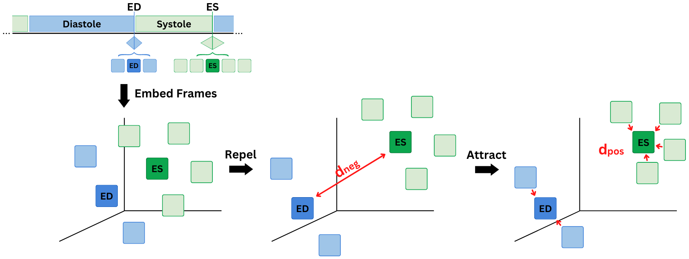
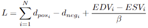

# EchoGNN with Contrastive Learning

EECE 571F course project by Nima Kondori, Jamie Goco, and Andrea Fung

## Abstract
Ejection fraction (EF) is a key metric used to assess the systolic performance of the left ventricle of the heart. Within recent years, many deep learning models have been developed to help automate the estimation of EF from echocardiograms. Among these works includes EchoGNN, a model based on Graph Neural Networks (GNNs) from Mokhtari \etal that aimed to provide an explainable EF estimation. However, EchoGNN acts as a skeleton implementation of GNNs in EF estimation applications and can therefore be further developed and improved on. One such improvement involves further investigation into the randomness of the embeddings EchoGNN generates and whether the EF estimation accuracy would improve if EchoGNN is given better embeddings. Recent works using contrastive learning to produce more informed embeddings have shown a lot of success in many areas of deep learning including medical applications. Therefore, our project shows how the integration of contrastive learning in a semi-supervised manner increases EchoGNN's accuracy of EF estimation.

The original EchoGNN by Masoud Mokhtari et al. can be found [here](https://github.com/DSL-Lab/echognn)

<p align="center">
  
</p>

## Contrastive Loss

The contrastive loss we implement aims to repel and distance dissimilar frames (ED and ES) in the resultant embedding space, while clustering together frames around the labeled ED and ES (neighbors).

<p align="center">
  
</p>

The loss function is as follows:

<p align="center">
  
</p>

where:
- N is the number of samples in the batch
- d_pos is the average distance between the anchors (labeled ED and ES frames) and positive samples (neighboring frames)
- d_neg is the normalized distance between the anchor (labeled ED frame) and the negative sample (labeled ES frame)
- volumetric margin, where EDVi and ESVi are the ED and ES volumes respectively and β = 200 is the scaling hyperparameter.

## Requirements
To install the requirements (preferably in a virtual env), run the following command:
```
pip install -U -r requirements.txt
```
The below optional packages may also be needed based on what is specified in the config file:
```
pip install wandb
pip install prettytable
```

## Dataset
EchoNet-Dynamic public EF dataset is used for this project. This dataset can be accessed
[here](https://echonet.github.io/dynamic/index.html).


## Training
```
python run.py --config_path <path_to_training_config> --save_dir <path_to_save_models_to>
```

## Evaluation
```
python run.py --config_path <path_to_training_config> --test
```
